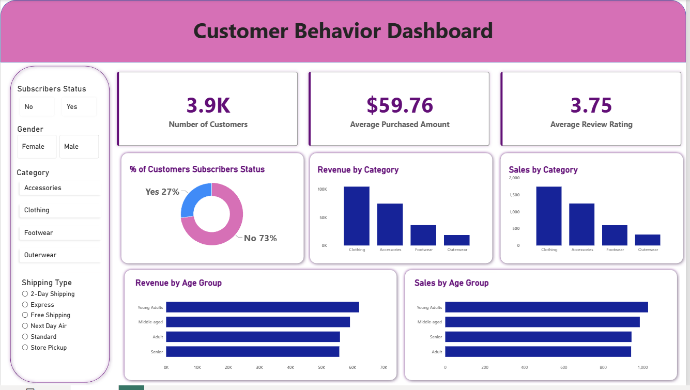
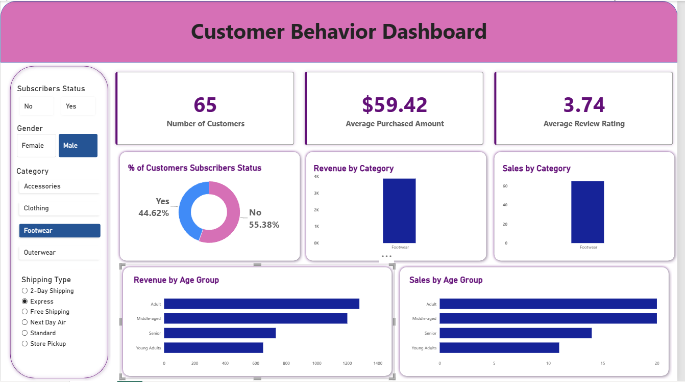
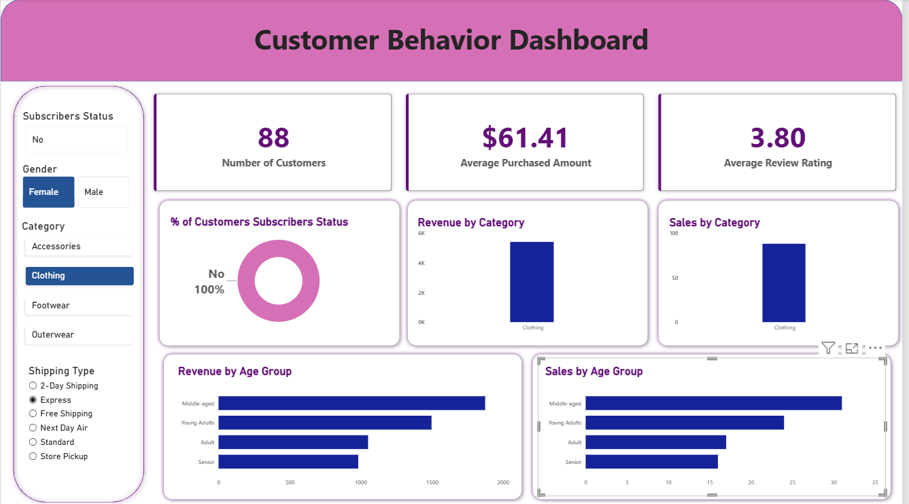

# Customer Shopping Behavior Analysis 

An end-to-end data analytics project examining customer purchase and sales behavior — from raw CSV to a PostgreSQL database to an interactive Power BI dashboard — using Python, SQL, and Power BI.

## Objective

To analyze customer shopping data and uncover trends in spending, discounts, subscriptions, and product performance, in order to answer key business questions around revenue drivers and customer segments.

## Tech Stack

- **Python** (pandas, SQLAlchemy, psycopg2) — data cleaning & loading
- **PostgreSQL** — data storage and querying
- **SQL** — business analysis queries
- **Power BI** — interactive dashboard & visualization

## Dataset

- **File:** `customer_shopping_behavior.csv`
- **Size:** 3,900 rows × 18 columns
- **Key fields:** Customer ID, Age, Gender, Item Purchased, Category, Purchase Amount, Location, Review Rating, Subscription Status, Shipping Type, Discount Applied, Previous Purchases, Payment Method, Frequency of Purchases

## Workflow

### 1. Data Cleaning (Python)
- Loaded raw CSV with pandas and inspected structure (`df.info()`, `df.head()`)
- Standardized column names to snake_case
- Identified that `discount_applied` and `promo_code_used` held identical information — dropped the redundant `promo_code_used` column
- Derived new features: `age_group` and `purchase_frequency_days`
- Loaded the cleaned dataset into a PostgreSQL database (`customer_behavior`) using SQLAlchemy

### 2. Data Analysis (SQL)
Wrote 10 business-question queries against the `customer` table, including:
- Revenue split by gender
- Customers who used a discount but still spent above average
- Top 5 products by average review rating
- Standard vs Express shipping — average spend comparison
- Subscriber vs non-subscriber spend and revenue
- Top 5 products by discount usage rate
- Customer segmentation (New / Returning / Loyal) by purchase count
- Top 3 products per category
- Repeat buyers (>5 purchases) vs subscription status
- Revenue contribution by age group

Full queries in [`customer_behavior.sql`](./customer_behavior.sql).

### 3. Visualization (Power BI)
Built an interactive dashboard (`customer_behavior.pbix`) with filters for Subscriber Status, Gender, Category, and Shipping Type — allowing users to slice revenue, sales, and customer metrics dynamically across these dimensions.

## Key Insights

- The dataset covers **3,900 customers**, with an average purchase amount of **$59.76** and an average review rating of **3.75/5**
- Only **27% of customers are subscribers**, yet the business relies on repeat/non-subscriber traffic for the bulk of volume (73% non-subscribed)
- **Clothing** is the dominant category — leading both revenue and units sold, followed by Accessories, Footwear, and Outerwear (lowest on both metrics)
- Revenue and sales are **fairly evenly distributed across age groups** (Young Adults, Middle-aged, Adult, Senior), with Young Adults contributing marginally the most — suggesting the customer base isn't concentrated in one age bracket

## Dashboard Preview

**Full view (unfiltered):**


**Filtered by Gender = Male, Category = Footwear, Shipping = Express:**


**Filtered by Gender = Female, Category = Clothing, Shipping = Express:**



*The dashboard supports filtering by Gender, Category, and Shipping Type — all visuals update dynamically based on selected filters.*

## Project Structure

```
customer-shopping-behavior-analysis/
├── customer_shopping_behavior.csv
├── Data_analysis.ipynb
├── customer_behavior.sql
├── customer_behavior.pbix
├── assets/
│   ├── Dashboard.png
│   ├── Male_filtered.png
│   └── Female_filtered.png
├── requirements.txt
└── README.md
```


## How to Run

1. Clone the repo:
```bash
   git clone https://github.com/Sufiyan-codes/Customer_Behavior.git
```
2. Install Python dependencies:
```bash
   pip install -r requirements.txt
```
3. Set up a local PostgreSQL database named `customer_behavior`
4. Run `notebooks/Data_analysis.ipynb` to clean the data and load it into PostgreSQL (update the DB credentials in the connection string to your own local setup)
5. Run the queries in `sql/customer_behavior.sql` to reproduce the analysis
6. Open `dashboard/customer_behavior.pbix` in Power BI Desktop to explore the dashboard

## Connect

**Sufiyan** — [GitHub](https://github.com/Sufiyan-codes) | [LinkedIn](https://www.linkedin.com/in/sufiyanchoudhary/)

## Acknowledgments

This project follows the workflow and structure taught in a tutorial by [Amlan Mohanty](https://youtu.be/5PrZvPeUw60). I implemented each step myself — writing the code, running the queries, and building the dashboard — using the dataset and problem framing provided in the tutorial.
